## 9.论文名称：Practical Deep Raw Image Denoising on Mobile Devices
* 链接：https://github.com/megvii-research/PMRID
* 简介：论文从噪声产生的原因出发，分析了影响噪声分布的分布，提出了 k-sigma转换。并针对端侧算法计算量大的现象，提出了基于可分离卷积的训练方法。
* 噪声图像成因分析：

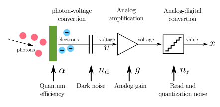

上图是相机成像过程。过程中的噪声包括shot noise、read-out noise和thermal noise

在不考虑噪声的情况下，在线性噪声模型下的相机成像是一个线性的放大：
$$x^*=g\alpha u^*$$(1)
其中，$u^*$ 为期望落在区域内的光子，$\alpha$是光电转换效率，$g$是增益。如果考虑上图中各个pipeline下的的噪声,则有如下公式：
$$x = g(\alpha u+n_d) + n_r$$
其中，$u$表示实际中区域收集到的光子，$n_d \sim N(0, \sigma^2_d)$, $n_r \sim N(0, \sigma^2_r)$, 表示增益前后的高斯噪声。$u$ 服从泊松分布:
$$u\sim P(u^*)$$
* 噪声参数估计：
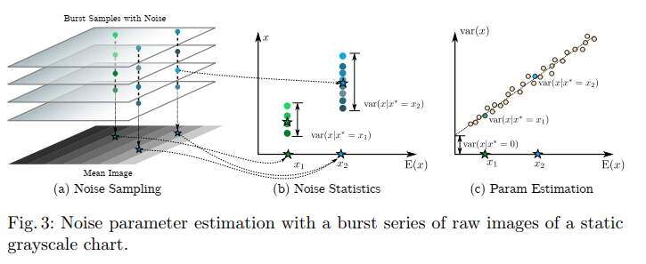
根据噪声公式，有以下分布：
$$x \sim (g\alpha)P(\frac{x^*}{g\alpha})+N(0, g^2\sigma^2_d+sigma^2_r)$$
令 $k = g\alpha$, $\sigma^2 = g^2\sigma^2_d+\sigma^2_r$, 原式可化简为：
$$x \sim kP(\frac{x^*}{k})+N(0,\sigma^2)$$
在检测均值和方差之后发现以下规律：

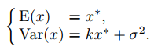

因此，文中定义一个线性的变换:

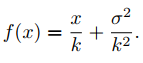

由模型可知，变换之后遵循以下分布：

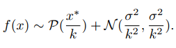

将泊松分布近似为高斯分布可得：

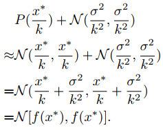
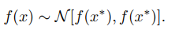

可以看出， $f(x)$ 的分布只依赖于 $f(x)$,如下图所示，可以训练一个简单的network，将 $f(x)$ 作为输入，并将输出$f(\hat{x}^*)$作为$f(x^*)$的估计。再通过反k-sigma变换获得x,达到降噪的目的。

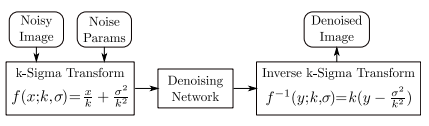

* 网络结构

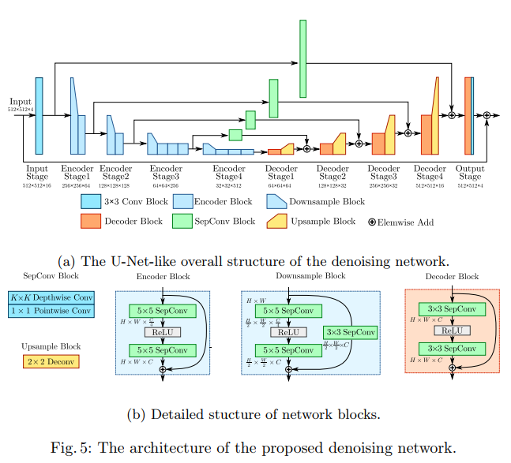

网络结构类似于unet和hourglass，便于提取特征。其中encoder使用5x5的卷积(扩大感受野)，decoder使用3x3的卷积，shortcut用于涨点和防止梯度消失。除开始和最后外，文中均使用depthwise 卷积来减小计算量。文中使用的损失函数是一范数损失。

* 实验结果

  - 噪声估计结果

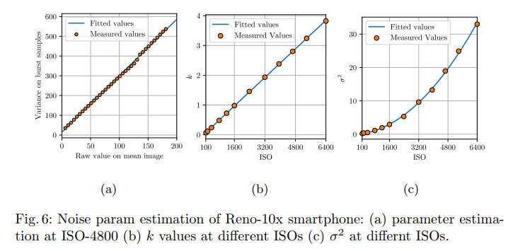

调整亮度，防止过曝或者欠曝。实验中可以看到，在每组ISO下都可以准确地估计出噪声参数。

  - PSNR

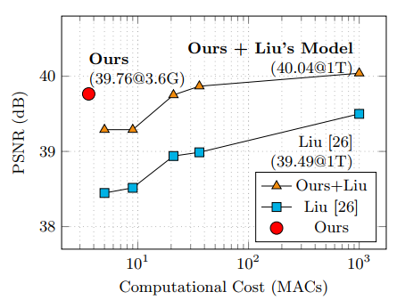

  - 不同模型对比

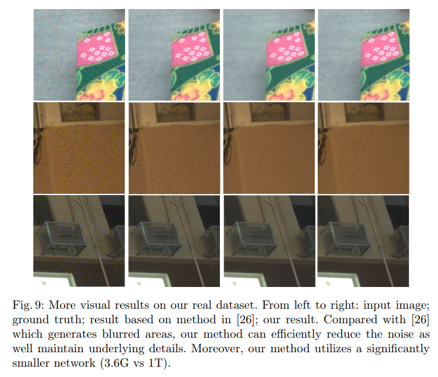